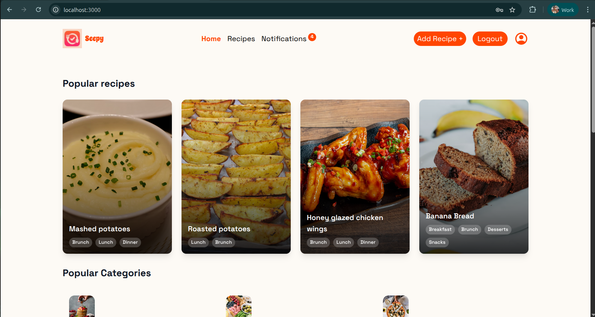
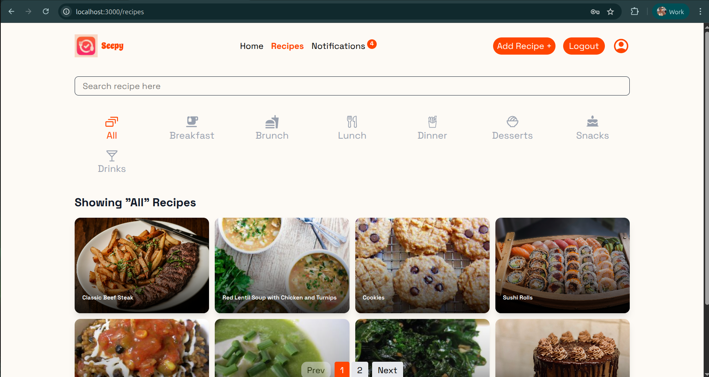
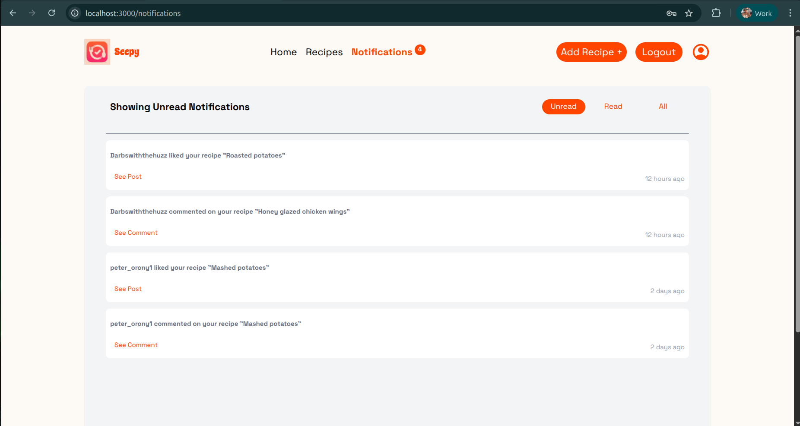
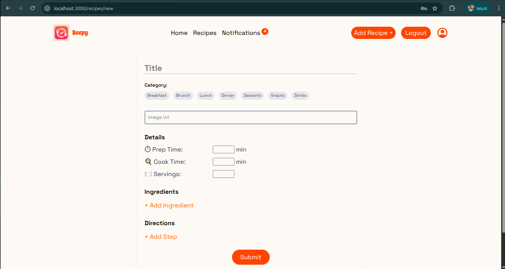
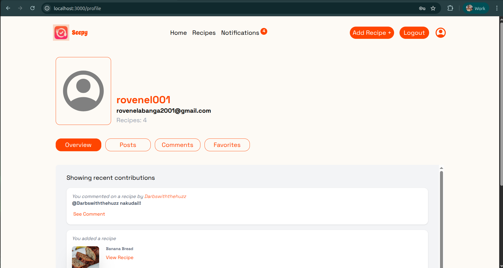

# Recipe Hub

Recipe Hub is a modern web application designed to bring food lovers together by providing an interactive platform for discovering, sharing, and managing recipes. Users can create accounts to explore a wide variety of dishes, filter recipes to suit their preferences, and engage with the community through comments and notifications. The platform emphasizes personalization, allowing users to build profiles, save their favorite recipes, and manage their own contributions by adding, editing, or deleting recipes.

## Features

- 🔑 User Authentication & Registration – Secure account creation and login system.

- 🍲 Recipe Filtering – Browse recipes by categories, ingredients, or dietary needs.

- 💬 Commenting – Share feedback, tips, or variations on recipes.

- 🔔 Notifications – Stay updated on recipe activity, comments, and favorites.

- ✍️ Recipe Management – Add new recipes, edit details, or delete existing ones.

- 👤 User Profiles – Personalized profiles showcasing contributions and activity.

- ⭐ Favorites – Save and organize recipes you love for quick access.

## Installation

Install my-project with npm

### Clone the project to your computer

```bash
  git clone git@github.com:rovenelabanga001/recipe-hub.git
  cd my-project
```

### Navigate to the project directory

```bash
cd recipe-hub
```

### Install dependencies

```bash
npm Install
```

### Run the server

```bash
npm run server
```

### Run the project

```bash
npm run dev
```

## Screenshots

### Home Page



### Recipes Page



### Notifications Page



### Add Recipes Page



### Profile Page


